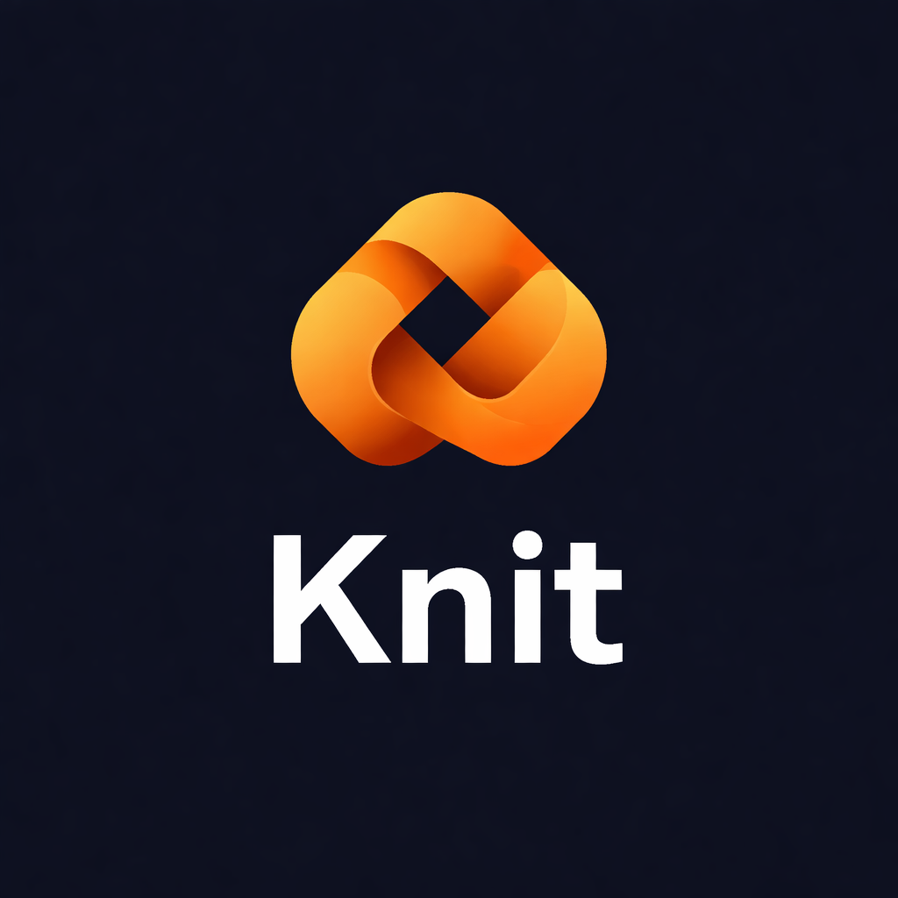
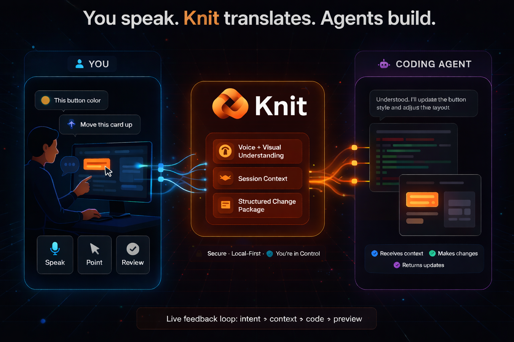
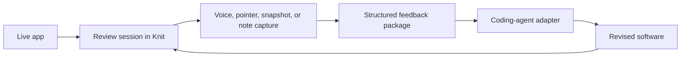

<p align="left">
  
</p>

Knit is a local-first runtime that turns spoken and visual feedback on live software into structured change requests for coding agents.

Knit sits between a running application and the systems you use to change it. Instead of asking people to write long tickets, annotate screenshots by hand, or reconstruct UI problems from memory, Knit lets them review software in context: point at the interface, speak about what should change, inspect the captured request, and send an approved package to a coding agent.

The project is aimed at teams who want a tighter loop between live product review and implementation. Designers, PMs, QA, founders, and engineers can all describe software more naturally when they are looking at the real thing. Coding agents are useful, but they still need grounded intent. Knit is the layer that captures that intent in a way that is reviewable, structured, and safe to hand off.

<p align="center">
  
</p>

## Get Started
### Prerequisites

- Go installed locally
- A supported desktop environment for the local daemon (Windows, Mac, Linux)
- A coding agent you actually plan to send work to, configured before your first submit
- Optional:
  - Codex CLI or API access
  - Claude Code-style CLI
  - OpenCode-compatible CLI
  - Python 3 for managed faster-whisper bootstrap (Speech to Text)

### Install and run the daemon

```bash
go run ./cmd/daemon
```
### Basic Session Flow

1. Start the daemon.
2. Open the local UI at `http://127.0.0.1:7777`.
3. Start a review session and select your workspace (where your code lives).
4. Capture feedback from the main UI, floating composer, or browser extension.
5. Choose what the agent should do with the approved feedback.
6. Preview the structured request.
7. Approve and submit it to your configured adapter. You can watch the 'Queue and delivery" on the Main UI for your update to finish or just go queue another one

## The Problem

Software feedback is usually detached from the software itself.

- Bug reports and design notes are often written after the fact, when important context is already gone.
- Screenshots and screen recordings help, but they still force someone to explain what mattered, where it happened, and what should change.
- Coding agents can move quickly once they have good input, but vague tickets and ungrounded prompts still produce vague output.
- Teams end up spending too much time translating “what I meant” into something an implementation system can actually use.

For UI and workflow feedback, pointing and speaking are often more precise than typing a long description. Knit is built around that fact.

## The Solution

Knit runs locally and captures approved review context during explicit feedback sessions.

It combines:

- typed notes
- spoken notes
- pointer and page context
- snapshots
- optional event-triggered video

Then it normalizes those signals into a structured feedback package, lets the user review and approve the result, and hands that package to a coding-agent adapter.

The key idea is simple: keep the human in control, keep the software context attached, and make the handoff to code generation explicit instead of magical.

## How It Works

1. Start a review session in the local Knit UI.
2. Open the target app and interact with it while Knit tracks the approved review context.
3. Speak, type, point, capture a snapshot, or attach a short clip to explain what should change.
4. Review the structured request before anything is sent onward.
5. Approve the package.
6. Submit it to a coding-agent adapter.
7. Review the next version and iterate again.



## Core Capabilities

Available now in this repository:

- Local review sessions with explicit start, pause, resume, stop, and delete flows
- Main local web UI served by the daemon
- Floating composer for fast capture while switching contexts
- Chromium extension side panel for browser-grounded capture and submission
- Typed notes, audio notes, snapshots, and optional tab video
- Pointer and browser-context grounding, including URL, route, selection, and focused-element details
- Structured request preview before submission
- Submission intent presets so the same approved feedback can implement changes, draft a plan, or create Jira tickets
- Editable agent prompt templates exposed from the review UI before preview or submit
- Approval-gated submission flow
- Coding-agent adapters for `codex_cli`, `codex_api`, `claude_cli`, `claude_api`, and `opencode_cli`
- Bundled local CLI wrappers for Codex, Claude, and OpenCode under `scripts/`
- Persisted submission queue with retry handling and restart recovery
- Encrypted local persistence for structured state and artifacts
- Audit logging, retention controls, and policy hooks

Available now, but worth calling out explicitly:

- Managed local transcription with faster-whisper
- Local CLI transcription mode
- LM Studio local transcription mode
- Remote transcription and remote submission controls that can be gated or disabled

## Security And Privacy

Knit is not intended to be spyware, passive monitoring, or background surveillance software.

The trust model is explicit:

- capture happens inside explicit session boundaries
- the user starts and stops review sessions intentionally
- capture scope is narrow by default
- browser capture is tied to the page or tab being reviewed
- user approval happens before coding-agent handoff
- artifacts are stored locally with encryption and retention controls
- outbound behavior is policy-gated and can be restricted
- transcription and agent providers are pluggable rather than hard-wired

Important design principles in the current implementation:

- No silent always-on background capture by default
- Visible review workflow with current session state in the UI
- Window-scoped and tab-scoped capture patterns instead of broad uncontrolled monitoring
- Token-authenticated local control APIs
- Replay-protected mutation endpoints
- Secure local storage and audit boundaries
- Redaction, retention, and enterprise policy hooks are part of the design, not an afterthought

If you are evaluating Knit for serious use, start here:

- [Getting Started](docs/GETTING_STARTED.md)
- [Architecture](docs/ARCHITECTURE.md)
- [Privacy Policy draft](docs/PRIVACY_POLICY.md)

## Architecture Overview

At a high level, Knit is a local runtime with a small number of clear boundaries:

- `cmd/daemon`
  Starts the local HTTP server, serves the main review UI, manages sessions, capture state, storage, policy checks, and submission orchestration.
- `cmd/tray`
  Native controller that ensures the daemon is running and exposes quick local controls.
- `internal/session`
  Canonical feedback and session lifecycle logic.
- `internal/storage`
  Local encrypted persistence for structured data and artifacts.
- `internal/server`
  Main UI, floating composer, extension endpoints, provider previewing, and submission APIs.
- `internal/transcription`
  Local and remote transcription providers.
- `internal/agents`
  Adapter layer that turns approved Knit packages into coding-agent requests.
- `extension/chromium`
  Browser companion UI for browser-grounded capture flows.

The architecture is deliberately agent-agnostic. Knit packages feedback into a structured internal form, then hands that off through adapters rather than baking one provider deep into the core runtime.

## Why Knit Is Different

Knit is not:

- just a screen recorder
- just another chat shell around an LLM
- just ticket automation

Knit is built for grounded, human-directed software iteration.

What makes it different:

- It starts from a live app, not from a blank prompt box.
- It treats human review and approval as part of the workflow, not friction.
- It preserves visual and interaction context instead of flattening everything into prose.
- It is local-first by design, with explicit capture boundaries and operator controls.
- It is open-source and extensible at the adapter, transcription, and capture layers.

## Getting Started

If you want the full operator walkthrough, use [docs/GETTING_STARTED.md](docs/GETTING_STARTED.md).

Quick start:

### Prerequisites

- Go installed locally
- A supported desktop environment for the local daemon and browser workflow
- A coding agent you actually plan to send work to, configured before your first submit
- Optional:
  - Codex CLI or API access
  - Claude Code-style CLI
  - OpenCode-compatible CLI
  - LM Studio
  - Python 3 for managed faster-whisper bootstrap

Knit is meant to augment an existing coding workflow, not replace it. Before you start a review session, make sure your submit adapter, workspace, and any required API keys or CLI commands are configured in `Settings -> Agent`, `knit.toml`, or `.env`.

### Run The Daemon

```bash
go run ./cmd/daemon
```

Then open:

```text
http://127.0.0.1:7777
```

On first run, Knit writes a user-facing config file at `./knit.toml` by default. If a legacy `./.knit/knit.toml` already exists, Knit will continue using it until you move it. Override either path with `KNIT_CONFIG_PATH` if you want the config somewhere else.

### Run With The Tray

```bash
go run ./cmd/tray
```

The tray acts as a controller around the daemon. Quitting the tray does not automatically stop the detached daemon process.

### Build Local Binaries

```bash
go build -o ./dist/local/daemon ./cmd/daemon
go build -o ./dist/local/ui ./cmd/ui
go build -o ./dist/local/tray ./cmd/tray
```

### Basic Session Flow

1. Start the daemon or tray.
2. Open the local UI at `http://127.0.0.1:7777`.
3. Configure your coding agent, workspace, and provider credentials.
4. Start a review session.
5. Capture feedback from the main UI, floating composer, or browser extension.
6. Choose what the agent should do with the approved feedback.
7. Preview the structured request.
8. Approve and submit it to your configured adapter.

### Configure Providers

The runtime configuration surface uses the `KNIT_*` environment namespace.

Common examples:

- Transcription mode: `KNIT_TRANSCRIPTION_MODE`
- Local transcription command: `KNIT_LOCAL_STT_CMD`
- Default submit adapter: `KNIT_DEFAULT_PROVIDER`
- Codex CLI adapter command: `KNIT_CLI_ADAPTER_CMD`
- Claude CLI adapter command: `KNIT_CLAUDE_CLI_ADAPTER_CMD`
- OpenCode CLI adapter command: `KNIT_OPENCODE_CLI_ADAPTER_CMD`
- Codex workdir: `KNIT_CODEX_WORKDIR`
- Storage directory: `KNIT_DATA_DIR`
- Local API token: `KNIT_CONTROL_TOKEN`

See [docs/GETTING_STARTED.md](docs/GETTING_STARTED.md) for the full environment surface.

When you run Knit from the repository, the runtime auto-fills the bundled wrapper scripts in `scripts/` for `codex_cli`, `claude_cli`, and `opencode_cli` if those command fields are blank.

## Configuration

Knit now has two explicit config surfaces:

- `knit.toml`
  Persistent user defaults for capture, agent runtime, prompt templates, retention, and policy-oriented settings.
- `.env`
  Secrets and env-only operational overrides such as `OPENAI_API_KEY`, `ANTHROPIC_API_KEY`, or `KNIT_CONFIG_PATH`.

The repository includes:

- [`knit.toml.example`](knit.toml.example)
- [`.env.example`](.env.example)

The configuration surface is broad, but it helps to think about it in five groups:

### 1. Transcription

- Local CLI transcription
- Managed faster-whisper
- LM Studio local STT
- Remote OpenAI-compatible transcription

### 2. Coding-Agent Adapters

- `codex_cli`
- `codex_api`
- `claude_cli`
- `claude_api`
- `opencode_cli`

The local CLI providers all consume the same delivery-intent model. The UI can ask them to:

- implement changes
- draft a plan
- create Jira tickets

### 3. Storage And Retention

- local data directory
- SQLite path
- encrypted artifact storage
- retention windows for audio, screenshots, video, transcripts, and structured state

### 4. Security And Policy

- local control token
- capability gating
- config lock
- provider allowlists
- outbound allowlist and blocklist
- TLS pinning and CA overrides
- integrity and release-manifest validation hooks

### 5. Capture Scope

- pointer sampling
- session controls
- transcription settings
- audio mode
- visual capture mode
- browser companion and extension pairing

For concrete settings, use:

- [docs/GETTING_STARTED.md](docs/GETTING_STARTED.md)
- [docs/ARCHITECTURE.md](docs/ARCHITECTURE.md)

## Repository Layout

```text
cmd/                    entrypoints for daemon, tray, and placeholder UI
internal/app/           application assembly and startup wiring
internal/server/        local HTTP API, main UI, floating composer, docs UI
internal/session/       session lifecycle and canonical feedback structures
internal/storage/       SQLite and artifact persistence
internal/transcription/ transcription providers and runtime management
internal/agents/        coding-agent adapter layer
extension/chromium/     Chromium extension popup and side-panel companion
packaging/              release packaging and npm wrapper scaffolding
scripts/                build, packaging, smoke, SBOM, and helper scripts
docs/                   user docs, architecture notes, privacy, store assets
test/                   release, packaging, and extension-oriented tests
```

## Roadmap

Near-term areas worth pushing forward:

- stronger browser grounding and richer DOM evidence capture
- cleaner desktop app and tray workflows
- more coding-agent adapters and better provider isolation
- persistent prompt-template library with built-in defaults, user-saved variants, and revert/reset flows shared across the main UI and popout composer
- improved fully local transcription paths
- stronger enterprise policy controls and deployment ergonomics

## Contributing

Issues and pull requests are welcome.

Useful contribution areas:

- capture modules and platform integration
- coding-agent adapters
- schema and canonical feedback design
- UI and review ergonomics
- browser extension UX
- docs and onboarding
- security hardening and policy controls

If you want to contribute, start by reading:

- [docs/ARCHITECTURE.md](docs/ARCHITECTURE.md)
- [docs/MVP_DECISIONS.md](docs/MVP_DECISIONS.md)
- [AGENTS.md](AGENTS.md)

The project is most useful when contributions make the feedback loop tighter, safer, and easier to trust.

## License

License is not finalized yet.

Current packaging metadata is marked `UNLICENSED`. Add the repository’s final open-source license before publishing broadly.
